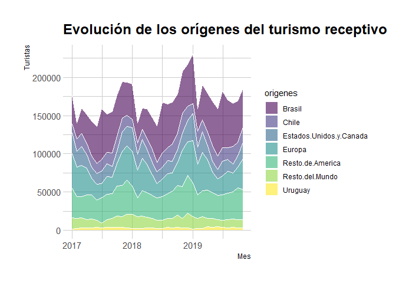
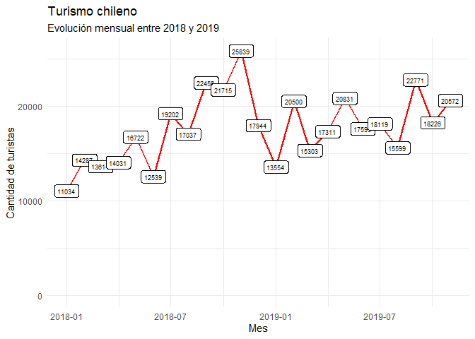
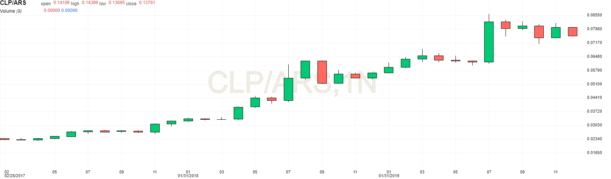
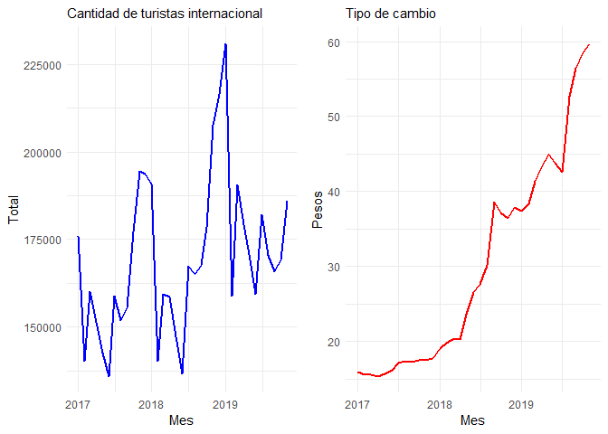
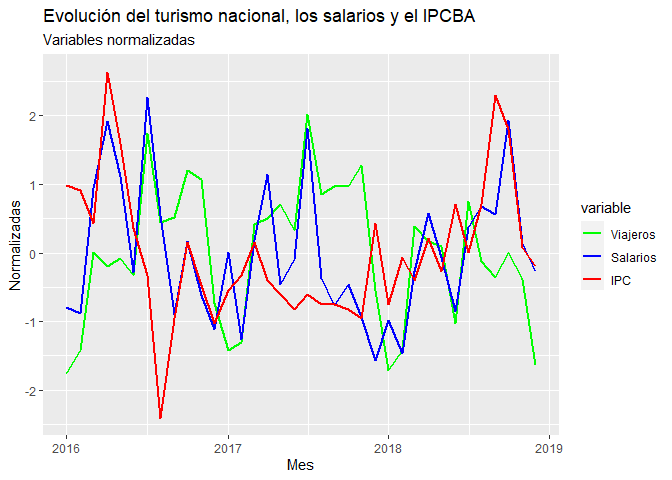

### VARIABLES PARA PROYECTAR EL TURISMO INTERNACIONAL

Para la proyección del turismo internacional de cara a los próximos 10 años, es necesario considerar una multiplicidad de variables, principalmente de origen económico, pero también otras socioculturales y de sanidad. 

En términos económicos, algunas de las variables que pueden incidir importantemente en los flujos turísticos son:

*	**Cambio.** El tipo de cambio real en el país y las condiciones para comercializar las diferentes divisas. Además de consultar las proyecciones realizadas por consultoras económicas, tener un seguimiento propio de los resultados de la balanza comercial, el flujo de pago de deuda y las reservas del BCRA es un aspecto importante para la comprensión del rumbo de este factor.
*	**Capacidad.** Las tasas de interés y la inflación de los países que más turistas aportan a la Ciudad también son aspectos económicos centrales, dado que pueden condicionar la capacidad de ahorro y de endeudamiento de los turistas para venir al país. En un mundo donde las tasas aumenten y en tanto la inflación no se vea controlada, la capacidad de planificación de los turistas se verá reducida. 
*	**Empresas.** Las proyecciones de crecimiento de las aerolíneas que operan en el país, tanto en términos de aumento de frecuencias como de distribución federal de esos vuelos, pueden servir a modo de indicador del clima de negocios que perciben las empresas. 
*	**Competencia provincial.** Los antecedentes y los nuevos movimientos en las provincias competidoras también son de especial atención. Si una provincia aumenta su capacidad operativa con nuevos aeropuertos o su oferta hotelera y de actividades sostenida y cualitativamente, es un indicador de alerta. También lo es la legislación de estos lugares: una regulación favorable a los proyectos de alquiler temporal al estilo Airbnb podrían también tener consecuencias negativas. 
*	**Competencia internacional.** El análisis de la competencia también se extiende a otros países, sumando aquí también un necesario análisis de su tipo de cambio, así como de su situación socio-política. Por ejemplo: una importante devaluación del real brasilero podría aumentar su atractivo turístico, pero revueltas sociales como la chilena podrían ser perjudiciales. 
*	**Aviación.** Elementos técnicos del avance de la aviación también son importantes: la reducción paulatina de los tiempos de vuelo en los últimos años es una señal positiva del rumbo que sigue esta actividad.
*	**Cultura.** Los cambios en los consumos culturales que se puedan asociar al turismo también son oportunidades y amenazas latentes. Por ejemplo, un avance del [_glamping_ como el que está viviendo España](https://bit.ly/3ut6yNh) iría en perjuicio de la oferta urbana como la de la CABA; así como también un avance de [movimientos ambientalistas como el _‘flygskam’_](https://bbc.in/35YJ74V), que se cree estuvo detrás de la caída de 5% en el tráfico aéreo en Suecia en el primer trimestre de 2019. 
*	**Pandemia.** La aparición de nuevas cepas de coronavirus o nuevos virus potenciales también deben ser tener en cuenta, dado la constante amenaza que representan para la movilidad humana y que siguen siendo de impacto a pesar del avance de la vacunación. 
*	**Intangibles.** Más allá de estas variables (prácticamente todas cuantificables), otros intangibles que puedan surgir también deben ser monitoreados. Por ejemplo, una aumento de las tensiones bélicas, como sucede en Ucrania, puede ser un importante depresor del turismo por el miedo a movilizarse. 


### DATOS DEL TURISMO INTERNACIONAL

Cargado y rápida exploración de los datos de turismo internacional. 


```r
inter <- read.csv('turismo_internacional.csv')

head(inter)
```

<div data-pagedtable="false">
  <script data-pagedtable-source type="application/json">
{"columns":[{"label":[""],"name":["_rn_"],"type":[""],"align":["left"]},{"label":["Mes"],"name":[1],"type":["chr"],"align":["left"]},{"label":["Brasil"],"name":[2],"type":["chr"],"align":["left"]},{"label":["Chile"],"name":[3],"type":["chr"],"align":["left"]},{"label":["Uruguay"],"name":[4],"type":["chr"],"align":["left"]},{"label":["Estados.Unidos.y.Canada"],"name":[5],"type":["chr"],"align":["left"]},{"label":["Resto.de.America"],"name":[6],"type":["chr"],"align":["left"]},{"label":["Europa"],"name":[7],"type":["chr"],"align":["left"]},{"label":["Resto.del.Mundo"],"name":[8],"type":["int"],"align":["right"]}],"data":[{"1":"1/1/2017","2":"37,323","3":"11,405","4":"1,714","5":"27,091","6":"38,179","7":"45,443","8":"14682","_rn_":"1"},{"1":"1/2/2017","2":"21,024","3":"15,787","4":"2,216","5":"21,052","6":"28,479","7":"38,491","8":"13267","_rn_":"2"},{"1":"1/3/2017","2":"33,221","3":"17,105","4":"3,054","5":"25,180","6":"27,773","7":"40,246","8":"13485","_rn_":"3"},{"1":"1/4/2017","2":"37,883","3":"14,359","4":"3,173","5":"18,332","6":"32,408","7":"34,639","8":"10432","_rn_":"4"},{"1":"1/5/2017","2":"44,897","3":"14,749","4":"3,374","5":"14,582","6":"31,082","7":"22,266","8":"11501","_rn_":"5"},{"1":"1/6/2017","2":"48,352","3":"13,384","4":"4,241","5":"13,699","6":"26,267","7":"20,825","8":"9149","_rn_":"6"}],"options":{"columns":{"min":{},"max":[10]},"rows":{"min":[10],"max":[10]},"pages":{}}}
  </script>
</div>

```r
inter <- mutate(inter, Mes = dmy(Mes))
```

Las comas presentadas por las variables que originalmente se cargan como variables de caracteres imposibilitan el paso directo al tipo de dato numérico o de enteros. 
Para resolver este problema, se eliminan todas las comas de las variables en cuestión y recién entonces se procede a su transformación.


```r
paises <- inter[,2:7]
for (i in seq_along(paises)){
  paises[[i]] <- str_replace(paises[[i]], "[,]", "")
}

inter <- inter%>%
  select(-c(2:7))%>%
  cbind(paises)%>%
  mutate_at(vars(3:8), funs(as.integer))

str(inter)
rm(paises,i)
```


Con todas las columnas transformadas al tipo de datos necesario, se calcula la cantidad de turistas internacionales por mes provenientes de todos los destinos considerados. 


```r
inter <- inter%>%
  mutate(Total = rowSums(inter[2:8]))
```

En base a esta nueva columna con los totales, se puede evaluar la proporción que cada origen representa en el mercado del turismo internacional para la Ciudad. 


```r
paises <- inter[2:8]
columnas <- paste0("Share_", colnames(paises[,]))
for(i in 1:7){
  paises[,columnas[i]] <- round((paises[,i]*100/inter$Total),2)
}
inter <- cbind(inter, paises[,8:14])
rm(paises, columnas, i)
head(inter)
```

<div data-pagedtable="false">
  <script data-pagedtable-source type="application/json">
{"columns":[{"label":[""],"name":["_rn_"],"type":[""],"align":["left"]},{"label":["Mes"],"name":[1],"type":["date"],"align":["right"]},{"label":["Resto.del.Mundo"],"name":[2],"type":["int"],"align":["right"]},{"label":["Brasil"],"name":[3],"type":["int"],"align":["right"]},{"label":["Chile"],"name":[4],"type":["int"],"align":["right"]},{"label":["Uruguay"],"name":[5],"type":["int"],"align":["right"]},{"label":["Estados.Unidos.y.Canada"],"name":[6],"type":["int"],"align":["right"]},{"label":["Resto.de.America"],"name":[7],"type":["int"],"align":["right"]},{"label":["Europa"],"name":[8],"type":["int"],"align":["right"]},{"label":["Total"],"name":[9],"type":["dbl"],"align":["right"]},{"label":["Share_Resto.del.Mundo"],"name":[10],"type":["dbl"],"align":["right"]},{"label":["Share_Brasil"],"name":[11],"type":["dbl"],"align":["right"]},{"label":["Share_Chile"],"name":[12],"type":["dbl"],"align":["right"]},{"label":["Share_Uruguay"],"name":[13],"type":["dbl"],"align":["right"]},{"label":["Share_Estados.Unidos.y.Canada"],"name":[14],"type":["dbl"],"align":["right"]},{"label":["Share_Resto.de.America"],"name":[15],"type":["dbl"],"align":["right"]},{"label":["Share_Europa"],"name":[16],"type":["dbl"],"align":["right"]}],"data":[{"1":"2017-01-01","2":"14682","3":"37323","4":"11405","5":"1714","6":"27091","7":"38179","8":"45443","9":"175837","10":"8.35","11":"21.23","12":"6.49","13":"0.97","14":"15.41","15":"21.71","16":"25.84","_rn_":"1"},{"1":"2017-02-01","2":"13267","3":"21024","4":"15787","5":"2216","6":"21052","7":"28479","8":"38491","9":"140316","10":"9.46","11":"14.98","12":"11.25","13":"1.58","14":"15.00","15":"20.30","16":"27.43","_rn_":"2"},{"1":"2017-03-01","2":"13485","3":"33221","4":"17105","5":"3054","6":"25180","7":"27773","8":"40246","9":"160064","10":"8.42","11":"20.75","12":"10.69","13":"1.91","14":"15.73","15":"17.35","16":"25.14","_rn_":"3"},{"1":"2017-04-01","2":"10432","3":"37883","4":"14359","5":"3173","6":"18332","7":"32408","8":"34639","9":"151226","10":"6.90","11":"25.05","12":"9.50","13":"2.10","14":"12.12","15":"21.43","16":"22.91","_rn_":"4"},{"1":"2017-05-01","2":"11501","3":"44897","4":"14749","5":"3374","6":"14582","7":"31082","8":"22266","9":"142451","10":"8.07","11":"31.52","12":"10.35","13":"2.37","14":"10.24","15":"21.82","16":"15.63","_rn_":"5"},{"1":"2017-06-01","2":"9149","3":"48352","4":"13384","5":"4241","6":"13699","7":"26267","8":"20825","9":"135917","10":"6.73","11":"35.57","12":"9.85","13":"3.12","14":"10.08","15":"19.33","16":"15.32","_rn_":"6"}],"options":{"columns":{"min":{},"max":[10]},"rows":{"min":[10],"max":[10]},"pages":{}}}
  </script>
</div>


Explorar visualmente estos resultados es de utilidad para comprender mejor lo que expresan. Para eso, se realizan dos gráficos: un gráfico de áreas apiladas sobre el total de la serie temporal analizada para observar la evolución nominal de los distintos orígenes y un gráfico de torta únicamente de 2018 (el úlitmo año completo con el que se cuenta) para entender las proporciones de mercado. 

##### Gráfico de áreas apiladas


```r
inter_st <- inter[,1:8]
stack <- t(inter_st[-1])
stack <- data.frame(stack)
colnames(stack) <- inter[,1]
origenes <- rownames(stack)
rownames(stack) <- NULL
stack <- cbind(origenes,stack)
rm(origenes, inter_st)
columnas <- colnames(stack)
columnas <- columnas[-c(1)]
stack <- stack%>%
  pivot_longer(cols = c(columnas), names_to = "Mes", values_to = "Turistas")%>%
  mutate(Mes = ymd(Mes))%>%
  mutate(Turistas=as.numeric(Turistas))
str(stack)
rm(columnas)
```


```r
ggplot(stack, aes(x=Mes, y=Turistas, fill=origenes)) + 
  geom_area(alpha=0.6 , size=.5, colour="white")+
  scale_fill_viridis(discrete = T) +
  theme_ipsum() + 
  ggtitle("Evolución de los orígenes del turismo receptivo")
```

<!-- -->


Puede observarse que todos los orígenes presentaron un comportamiento estacional relativamente similar, a excepción de Uruguay, que presenta un comportamiento algo opuesto: sus momentos de mayor tráfico coinciden con los mínimos de otros países. 
También resulta destacable la alta sincronía que presentan Europa, América del Norte y Chile. 

##### Gráfico de torta


```r
agrupado <- inter%>%
  filter(year(Mes)=='2018')%>%
  mutate(Anio = '2018')%>%
  select(-Mes)%>%
  group_by(Anio)%>%
  summarise(Resto.del.Mundo = sum(Resto.del.Mundo),
            Brasil = sum(Brasil),
            Chile = sum(Chile),
            Uruguay = sum(Uruguay),
            Estados.Unidos.y.Canada = sum(Estados.Unidos.y.Canada),
            Resto.de.America = sum(Resto.de.America),
            Europa = sum(Europa))

agrupado <- t(agrupado[-1])
agrupado <- data.frame(agrupado)
colnames(agrupado) <- 'tot_2018'
origenes <- rownames(agrupado)
rownames(agrupado) <- NULL
agrupado <- cbind(origenes,agrupado)
rm(origenes)
agrupado <- agrupado %>% 
  arrange(desc(origenes)) %>%
  mutate(share = round((tot_2018 / sum(agrupado$tot_2018) *100),2))%>%
  mutate(ypos = cumsum(share)- 0.5*share )


ggplot(agrupado, aes(x="", y=share, fill=origenes)) +
  geom_bar(stat="identity", width=1, color="white") +
  coord_polar("y", start=0) +
  theme_void() + 
  geom_text(aes(y = ypos, label = share), color = "black", size=3, fontface = "bold") +
  scale_fill_viridis(discrete = T) +
  labs(title = 'Proporción de los orígenes del turismo receptivo', 
       subtitle='En 2018', fill = 'Orígenes')
```

<!-- -->

El gráfico de tortas da una mejor dimensión de la importancia que tiene el turismo americano para el país: 

* 1 de cada 4 turistas no residentes provienen de Brasil
* 6 de cada 10 son de América Central o del Sur. 
* Solo 3 de cada 10 provienen de EEUU o Europa.

Este último punto puede señalar la necesidad de mejorar la oferta turística y el acceso a la Ciudad para las personas provenientes de estos dos destinos, siendo que posiblemente son los que presenten un mayor poder adquisitivo y por tanto un mayor beneficio para el sector. 


### TURISMO CHILENO EN BUENOS AIRES

Para hacer un análisis del turismo chileno entre 2018 y 2019 se filtra el dataframe para reducir sus dimensiones a las que serán exclusivamente necesarias para este punto. 


```r
chile <- inter%>%
  select(Mes, Chile, Share_Chile)%>%
  filter(year(Mes)==2018 | year(Mes)==2019)
```

El turismo chileno muestra un claro patrón estacional, con aumentos nominales en el último trimestra de cada año e importantes caídas en los meses de enero. Este patrón también se encontró en el año 2017.

Más allá de esto, de la evolución temporal se desprende una interesante tendencia creciente de mediano o largo plazo en la cantidad nominal de turistas chilenos dado que el gráfico presenta mínimos ascendentes, es decir, los momentos de menos turismo (los puntos más bajos del gráfico) son interanualmente cada vez más elevados. 


```r
ggplot(chile)+
  geom_line(aes(x=Mes, y=Chile), colour='red', size=1)+
  geom_label(aes(x =Mes, y=Chile, label=Chile), position = position_stack(), size=2.5)+
  theme_minimal()+
  labs(title='Turismo chileno', subtitle = 'Evolución mensual entre 2018 y 2019', 
       x='Mes', y='Cantidad de turistas', color='')
```

<!-- -->


```r
ggplot(chile)+
  geom_line(aes(x=Mes, y=Share_Chile), colour='blue', size=1)+
  geom_label(aes(x =Mes, y=Share_Chile, label=Share_Chile), position = position_stack(), size=2.5)+
  theme_minimal()+
  labs(title='Share del turismo chileno', subtitle = 'Evolución mensual entre 2018 y 2019', 
       x='Mes', y='Porcentaje',color='')
```

<!-- -->

Algo similar ocurre en la incidencia que tiene el turismo chileno sobre el total del turismo internacional, siendo un mercado cada vez más importante (aunque con un crecimiento lento).

Esta tendencia se corresponde con un aumento sostenido del valor del peso chileno en relación con el peso argentino, economizando el costo de viajar para los turistas del país vecino. 

image: 


Finalmente, la incorporación en esos años de una importante cantidad de [nuevas rutas aéreas regulares a diferentes ciudades de Chile](https://bit.ly/3jpElR2) más allá de su capital y la habilitación a nuevas provincias para operar vuelos internacionales , así como el comienzo de las operaciones de la [aerolínea chilena low cost Jet Smart](https://bit.ly/3xh2ZeS) (que no solo conectó a Santiago de Chile con Buenos Aires, si no que además sumó conexiones con Córdoba y Mendoza en Argentina y La Serena en Chile), también son importantes propulsores para el crecimiento de este mercado.


### LA INFLUENCIA DEL TIPO DE CAMBIO

Un primer pensamiento lógico en torno a la evolución del turismo internacional lleva a la premisa de que un tipo de cambio elevado facilita la llegada de no residentes en el país. Se incorpora una variable de tipo de cambio real (BCRA) al análisis:


```r
cambio <- read_xls('com3500.xls', col_types = c("date", "numeric"))
cambio <- cambio%>%
  filter(year(Mes)==2017 | year(Mes)==2018 | year(Mes)==2019)%>%
  filter(!(year(Mes)==2019 & month(Mes)==12))


inter_cambio <- inter%>%
  select(Mes, Total)%>%
  left_join(cambio)
```

```
## Joining, by = "Mes"
```

```r
inter_cambio <- rename(inter_cambio, 'Cambio' = "Tipo de cambio nominal promedio mensual")
```


Pero el crecimiento del tipo de cambio se ha acelerado mucho más en los últimos años que el crecimiento del turismo internacional. Es decir, el ritmo de devaluación no se tradujo en un mismo de aumento del turismo de otros países, como puede apreciarse en el siguiente gráfico. 


```r
plot_turistas <- ggplot(inter_cambio)+
  geom_line(aes(x=Mes, y=Total),colour='blue', size=1)+
  theme_minimal()+
  labs(subtitle = 'Cantidad de turistas internacional', 
       x='Mes', color='')

plot_cambio <- ggplot(inter_cambio)+
  geom_line(aes(x=Mes, y=Cambio), colour='red', size=1)+
  theme_minimal()+
  labs(subtitle = 'Tipo de cambio', y='Pesos', color='')

plot_grid(plot_turistas, plot_cambio, align = "h")
```

<!-- -->


De igual manera, entendiendo que son procesos que operan con altas diferencias temporales y los efectos visibles no son inmediatos por la planificación que implica el viaje para el turista, tiene sentido creer que la devaluación del peso sí ha fomentado los arribos internacionales. Dado que el tipo de cambio real se duplicó entre 2017 y 2018, es posible considerar que esto fomentó el turismo meses después, como se ve a fines de 2018.

De hecho, si bien a fines de año el turismo internacional siempre parece mostrar su mejor momento, entre diciembre de 2017 y 2018 se aprecia un crecimiento interanual notable del 11,75%.


```r
## Mejora importante interanual
a <- filter(inter_cambio, ymd(Mes) == '2017-12-01')
b <- filter(inter_cambio, ymd(Mes) == '2018-12-01')
print(b[2]*100/a[2]-100)
```

```
##      Total
## 1 11.75578
```

```r
rm(a, b)
```


Por otro lado, la tendencia alcista del turismo internacional prende una alerta al mostrar que los últimos tres meses registrados en la serie (septiembre, octubre y noviembre de 2019) comenzaban a mostrar caídas interanuales, a pesar de haber sido los momentos de mayor flujo de turismo internacional en años anteriores. Si bien esta caída no representa "nuevos mínimos", sí que los mejores momentos se vieron reducidos en relación a años anteriores, llevando a una caída general en el promedio anual.

**¿Qué orígenes explican esta caída?**

Para entender estos descensos, se evalúan los cambios que se dieron en el flujo de turistas en los trimestres compuestos por los meses de septiembre, octubre y noviembre de los tres años de estudio. 

Se transformará la base de datos de manera tal de agregar la cantidad de turistas según origen en cada trimestre, para luego comparar la variación interanual que estos trimestres representan.


```r
#trimestre 2017
aux_17 <- inter%>%
  select(c(1:8))%>%
  filter(ymd(Mes)=='2017-09-01' |ymd(Mes)=='2017-10-01' |ymd(Mes)=='2017-11-01')
tur_17 <- t(aux_17[-1])
colnames(tur_17) <- as.character.Date(aux_17[,1])
tur_17 <- data.frame(tur_17)
rm(aux_17)
tur_17 <- tur_17%>%
  mutate(trim_17 = rowSums(tur_17[,1:3]))%>%
  select(trim_17)

#trimestre 2018
aux_18 <- inter%>%
  select(c(1:8))%>%
  filter(ymd(Mes)=='2018-09-01' |ymd(Mes)=='2018-10-01' |ymd(Mes)=='2018-11-01')
tur_18 <- t(aux_18[-1])
colnames(tur_18) <- as.character.Date(aux_18[,1])
tur_18 <- data.frame(tur_18)
rm(aux_18)
tur_18 <- tur_18%>%
  mutate(trim_18 = rowSums(tur_18[,1:3]))%>%
  select(trim_18)

#trimestre 2019
aux_19 <- inter%>%
  select(c(1:8))%>%
  filter(ymd(Mes)=='2019-09-01' |ymd(Mes)=='2019-10-01' |ymd(Mes)=='2019-11-01')
tur_19 <- t(aux_19[-1])
colnames(tur_19) <- as.character.Date(aux_19[,1])
tur_19 <- data.frame(tur_19)
rm(aux_19)
tur_19 <- tur_19%>%
  mutate(trim_19 = rowSums(tur_19[,1:3]))%>%
  select(trim_19)

#tabla unificada de trimestres comparados
tur_comp <- cbind(tur_17, tur_18, tur_19)
rm(tur_17, tur_18, tur_19)
tur_comp <- tur_comp%>%
  mutate(inter_17.18 = round(((tur_comp[,2]*100/tur_comp[,1])-100),2))%>%
  mutate(inter_18.19 = round(((tur_comp[,3]*100/tur_comp[,2])-100),2))

kable(tur_comp)
```


|                        | trim_17| trim_18| trim_19| inter_17.18| inter_18.19|
|:-----------------------|-------:|-------:|-------:|-----------:|-----------:|
|Resto.del.Mundo         |   40070|   41962|   33410|        4.72|      -20.38|
|Brasil                  |  156128|  161533|  161309|        3.46|       -0.14|
|Chile                   |   54932|   70010|   61569|       27.45|      -12.06|
|Uruguay                 |   11817|    9576|    9751|      -18.96|        1.83|
|Estados.Unidos.y.Canada |   55394|   53937|   48046|       -2.63|      -10.92|
|Resto.de.America        |  113246|  114517|  116274|        1.12|        1.53|
|Europa                  |   95319|  102212|   90776|        7.23|      -11.19|

En la comparación interanual, se aprecia una caída generalizada todos los destinos menos ‘Resto de América’ y de Uruguay. 
Mientras las caídas más importantes del turismo receptivo provienen de Chile, Norte América y Europa, así como de otros lugares del mundo. Si bien Norte América ya había mostrado en el período 17-18 una leve caída, esta se acentuó en el período siguiente. 

Una cuestión relevante a la caída interanual chilena puede ser la revuelta social que se produjo en el país a fines de 2019, generando importantes problemas operativos y logísticos en todo su territorio, aunque esto no explica enteramente el fenómeno, si no que es parte de una depresión general del turismo internacional. 


### TURISMO NACIONAL

La creciente inflación de los últimos años ha afectado importantemente la capacidad de organización y planificación de la economía familiar argentina. Esto puede tener efectos claros y directos en la capacidad de ahorro y, por consiguiente, en el volumen del tráfico nacional. 

Para evaluar estas relaciones, primero se cargan los datos de turismo nacional y se observará su desarrollo en el período entre 2016 y 2018. 

```r
nacional <- read.csv('turismo_nacional.csv')
head(nacional)
```

<div data-pagedtable="false">
  <script data-pagedtable-source type="application/json">
{"columns":[{"label":[""],"name":["_rn_"],"type":[""],"align":["left"]},{"label":["year"],"name":[1],"type":["int"],"align":["right"]},{"label":["mes_nom"],"name":[2],"type":["chr"],"align":["left"]},{"label":["categoria"],"name":[3],"type":["chr"],"align":["left"]},{"label":["viajeros"],"name":[4],"type":["int"],"align":["right"]}],"data":[{"1":"2016","2":"Abril","3":"1 y 2*","4":"39697","_rn_":"1"},{"1":"2016","2":"Abril","3":"3*","4":"35782","_rn_":"2"},{"1":"2016","2":"Abril","3":"4*","4":"62525","_rn_":"3"},{"1":"2016","2":"Abril","3":"5*","4":"18981","_rn_":"4"},{"1":"2016","2":"Abril","3":"Apart","4":"19634","_rn_":"5"},{"1":"2016","2":"Abril","3":"Hostel","4":"3860","_rn_":"6"}],"options":{"columns":{"min":{},"max":[10]},"rows":{"min":[10],"max":[10]},"pages":{}}}
  </script>
</div>

```r
nacional <- nacional%>%
  mutate(mes = case_when(mes_nom == 'Enero' ~ "-01",
                         mes_nom == 'Febrero' ~ "-02",
                         mes_nom == 'Marzo' ~ "-03",
                         mes_nom == 'Abril' ~ "-04",
                         mes_nom == 'Mayo' ~ "-05",
                         mes_nom == 'Junio' ~ "-06",
                         mes_nom == 'Julio' ~ "-07",
                         mes_nom == 'Agosto' ~ "-08",
                         mes_nom == 'Septiembre' ~ "-09",
                         mes_nom == 'Octubre' ~ "-10",
                         mes_nom == 'Noviembre' ~ "-11",
                         mes_nom == 'Diciembre' ~ "-12"))

nacional <- nacional%>%
  mutate(year = as.character(year))%>%
  select(-mes_nom)

mes <- paste0(nacional$year, nacional$mes, "-01")
nacional[,5] <- mes


nacional <- nacional%>%
  select(-year, -mes)%>%
  mutate(mes = ymd(V5))%>%
  select(-V5)%>%
  mutate(viajeros=as.numeric(viajeros))

str(nacional)
```

```
## 'data.frame':	288 obs. of  3 variables:
##  $ categoria: chr  "1 y 2*" "3*" "4*" "5*" ...
##  $ viajeros : num  39697 35782 62525 18981 19634 ...
##  $ mes      : Date, format: "2016-04-01" "2016-04-01" ...
```


Para esta evaluación inicial, se realiza un gráfico de áreas apiladas.


```r
ggplot(nacional, aes(x=mes, y=viajeros, fill=categoria)) + 
  geom_area()+
  scale_fill_viridis(discrete = T) +
  theme_ipsum() + 
  ggtitle("Evolución de los tipos de alojamientos de los turistas nacionales")
```

<!-- -->

A simple vist, resulta claro que los hoteles siguen siendo los dominadores del sector turístico, a pesar del crecimiento de proyectos parahoteleros como pueden ser Airbnb.
Por otro lado, se observan importantes bajas estacionales en los meses de enero, cuando el turismo se dirige a otros lugares del país como la Costa Atlántica, el norte o la Patagonia. 


Se agregan nuevas variables asociadas al poder adquisitivo y de planificación de las personas, como la variación salarial y el IPC medido en la Ciudad de Buenos Aires. 


```r
### IPC

ipc <- read_xlsx('Evol_gral_bs_svcios.xlsx', col_types = c("date", "numeric", "numeric", "numeric", "numeric", "numeric", "numeric"))
str(ipc)
```

```
## tibble [119 x 7] (S3: tbl_df/tbl/data.frame)
##  $ ...1             : POSIXct[1:119], format: "2012-07-01" "2012-08-01" ...
##  $ Nivel General...2: num [1:119] 112 114 116 118 120 ...
##  $ Bienes...3       : num [1:119] 112 114 116 118 120 ...
##  $ Servicios...4    : num [1:119] 111 115 116 118 120 ...
##  $ Nivel General...5: num [1:119] 1.9 2.3 1.5 1.5 2.1 2 2.3 1.1 1.5 2 ...
##  $ Bienes...6       : num [1:119] 1.7 1.4 1.8 1.8 2.3 1.2 1.6 0.7 2.1 2 ...
##  $ Servicios...7    : num [1:119] 2.1 3.1 1.2 1.2 1.9 2.6 2.9 1.4 1 2 ...
```


```r
ipc <- ipc[,c(1,5)]
colnames(ipc)[1] <- 'mes'
colnames(ipc)[2] <- 'IPC'
ipc <- mutate(ipc, mes=ymd(mes))
ipc <- filter(ipc, year(mes) == 2016 | year(mes)== 2017 | year(mes)== 2018)
head(ipc)
```

<div data-pagedtable="false">
  <script data-pagedtable-source type="application/json">
{"columns":[{"label":["mes"],"name":[1],"type":["date"],"align":["right"]},{"label":["IPC"],"name":[2],"type":["dbl"],"align":["right"]}],"data":[{"1":"2016-01-01","2":"4.1"},{"1":"2016-02-01","2":"4.0"},{"1":"2016-03-01","2":"3.3"},{"1":"2016-04-01","2":"6.5"},{"1":"2016-05-01","2":"5.0"},{"1":"2016-06-01","2":"3.2"}],"options":{"columns":{"min":{},"max":[10]},"rows":{"min":[10],"max":[10]},"pages":{}}}
  </script>
</div>


```r
### SALARIOS

salarios <- read_xls('variaciones_salarios_03_22.xls')
str(salarios)
```

```
## tibble [36 x 3] (S3: tbl_df/tbl/data.frame)
##  $ ...1                                          : num [1:36] 2016 2016 2016 2016 2016 ...
##  $ ...2                                          : chr [1:36] "Enero" "Febrero" "Marzo" "Abril" ...
##  $ Variación porcentual respecto del mes anterior: num [1:36] 1.41 1.32 3.15 4.12 3.32 1.92 4.47 2.75 1.31 2.37 ...
```


```r
colnames(salarios)[1] <- 'anio'
colnames(salarios)[2] <- 'mes'
colnames(salarios)[3] <- 'salarios'

salarios <- salarios%>%
  mutate(mes = case_when(mes == 'Enero' ~ "-01",
                         mes == 'Febrero' ~ "-02",
                         mes == 'Marzo' ~ "-03",
                         mes == 'Abril' ~ "-04",
                         mes == 'Mayo' ~ "-05",
                         mes == 'Junio' ~ "-06",
                         mes == 'Julio' ~ "-07",
                         mes == 'Agosto' ~ "-08",
                         mes == 'Septiembre' ~ "-09",
                         mes == 'Octubre' ~ "-10",
                         mes == 'Noviembre' ~ "-11",
                         mes == 'Diciembre' ~ "-12"))

mes <- paste0(salarios$anio, salarios$mes, "-01")
salarios[,'mes'] <- mes

salarios <- salarios%>%
  mutate(mes = ymd(mes))%>%
  select(-anio)
str(salarios)

sal_inf <- left_join(salarios, ipc)

turismo_nac <- nacional%>%
  group_by(mes)%>%
  summarise(viajeros = sum(viajeros))
```


```r
turismo_nac <- left_join(turismo_nac, sal_inf)

kable(cor(turismo_nac[, c(2,3,4)]))
```


|         |   viajeros|  salarios|        IPC|
|:--------|----------:|---------:|----------:|
|viajeros |  1.0000000| 0.4305624| -0.2885396|
|salarios |  0.4305624| 1.0000000|  0.3511021|
|IPC      | -0.2885396| 0.3511021|  1.0000000|


Si bien no parece haber una clara y directa correlación estadística entre el turismo nacional a la Ciudad, la inflación y evolución de los salarios, los valores expresados en la tabla sí dan un indicio de que la evolución salarial puede tener una cierta influencia en el comportamiento del turismo. 

De igual manera, así como lo expresado en el análisis del turismo internacional, es necesario considerar la ventana temporal entre la evolución del fenómeno adquisitivo y su afección al turismo. 

Esto puede apreciarse mejor en el siguiente gráfico, que normaliza los valores de las tres categorías para tener una visualización más acertada de su comportamiento. 


```r
turismo_nac <- turismo_nac%>%
  mutate(viajeros_scal = scale(viajeros))%>%
  mutate(salarios_scal = scale(salarios))%>%
  mutate(IPC_scal = scale(IPC))

normalizadas <- turismo_nac[,c(1,5,6,7)]
normalizadas <- melt(normalizadas, id=c('mes'))

ggplot(normalizadas)+
  geom_line(aes(x=mes, y=value, colour=variable), size=1)+
  scale_colour_manual(values = c('green', 'blue', 'red'), 
                      labels=c('Viajeros', 'Salarios', 'IPC'))+
  labs(title= 'Evolución del turismo nacional, los salarios y el IPCBA',
       subtitle= 'Variables normalizadas', y='Normalizadas', x='Mes')
```

<!-- -->

En el gráfico puede apreciarse que a los picos de inflación de principios y mitad de 2016 (ambos superando la evolución salarial) le siguen caídas en la cantidad de visitantes en los meses posteriores; así como las recuperaciones salariales de la primera mitad de 2017 generaron nuevos picos de turismo en el segundo semestre de ese mes. 
Por otro lado, la escalada inflacionaria de los últimos meses de 2017, que superó ampliamente a la evolución salarial durante casi todos los meses hasta último trimestre de 2018 generó una fuerte afección en el turismo nacional, reduciendo en este último año sus resultados en relación a la buena performance expresada durante 2017. 

Finalmente, es interesante comparar la evolución del mercado parahotelero en la Ciudad. 


```r
para <- filter(nacional, categoria == 'Para Hoteles')
hot <- filter(nacional, categoria != 'Para Hoteles')
hot <- mutate(hot, categoria = 'Otros')
para_hot <- rbind(para, hot)

para_hot <- para_hot%>%
  group_by(mes, categoria)%>%
  summarise(viajeros=sum(viajeros))
```

```
## `summarise()` has grouped output by 'mes'. You can override using the `.groups` argument.
```

```r
total <- para_hot%>%
  group_by(mes)%>%
  summarise(total=sum(viajeros))
para_hot <- left_join(para_hot, total)
```

```
## Joining, by = "mes"
```

```r
para_hot <- para_hot%>%
  mutate(share=round((viajeros*100/total),2))
```


```r
ggplot(para_hot)+
  geom_line(aes(x=mes, y=share, colour=categoria), size=1)+
  scale_colour_manual(values = c('blue', 'red'), 
                      labels=c('Hoteles', 'Para Hoteles'))+
  labs(title= 'Cambios en el reparto del mercado',
       subtitle= 'Oferta parahotelera', y='Share', x='Mes')
```

<!-- -->

Si bien los movimientos aún son leves, se aprecia un crecimiento de la oferta parahotelera en los 3 años a costa de una pérdida de mercado de lo oferta hotelera tradicional. 
Aunque la participación todavía sea muy minoritaria, el share de mercado de este tipo de oferta pasó de 13,24% en diciembre de 2016 al 18,18% en diciembre de 2018. 
